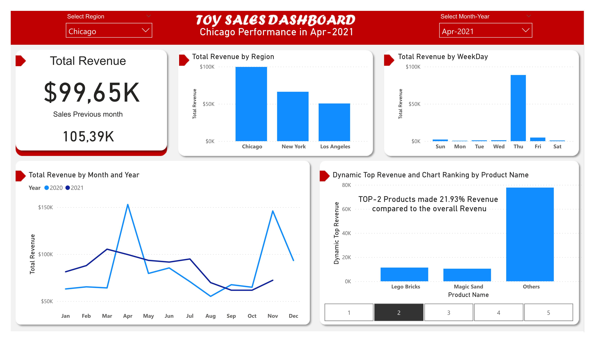

# Analyse des ventes d'un magasin de jouets

## Description du Projet

Ce projet se concentre sur le chiffre d'affaires global, incluant tous les magasins et villes. On identifie les produits ayant générés le plus de chiffre d'affaires, on examine la tendance mensuelle du chiffre d'affaires et on compare le chiffre d'affaires dans différentes régions.

## Jeu de Données

**Data.xlsx** : le fichier data.xlsx contient les détails des ventes comme le nom des produits, le nom des magasins, les regions, ect... 

## Méthodologie

### 1. Nettoyage et Transformation des données
On utilise Power Query pour importer, nettoyer et transformer les données.

**Tâches** :

- Eliminer les lignes et colonnes inutiles
- Corriger les types de données
- Normaliser les données en créant les tables 'region' et 'store'

### 2. Modélisation des Données
On établie des relations entre les différentes tables puis on crée des mesures DAX pour l'analyse.

### 3. Analyse des Données

### 4. Visualisation et Rapport
On présente les resultats sous forme de tableaux de bord interactifs.

## KPI

- **Chiffre d'affaire du mois**
- **Chiffre d'affaire du mois précédent**

## Analyse de Données

1. Identification des Produits Performants :
On conçoit un sytème de Top N permettant d'identifier les produits les plus performants en termes de chiffre d'affaires.

2. Tendance du Chiffre d'Affaires Mensuel :
On crée un graphique de tendance montrant l'évolution du chiffre d'affaires au fil des mois.

3. Comparaison du Chiffre d'Affaires par Région :
On construit un diagramme en barres verticales mettant en évidence les différences de chiffre d'affaires entre les régions.

4. Filtres :
On ajoute des filtres permettent de filtrer les données par mois/années et par régions.

## Outils et Technologies utilisées :

-	Power BI
-	Power Query
-	DAX

## Screenshots :

